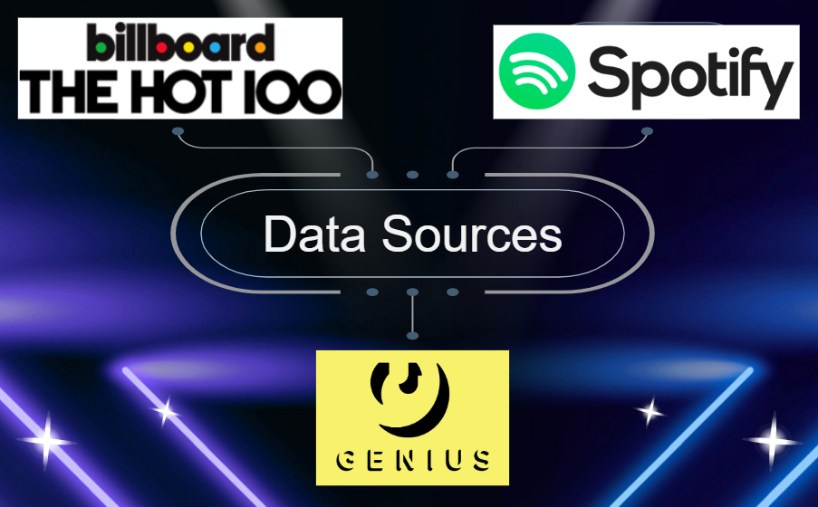
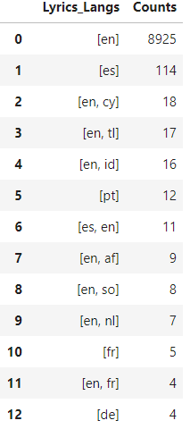
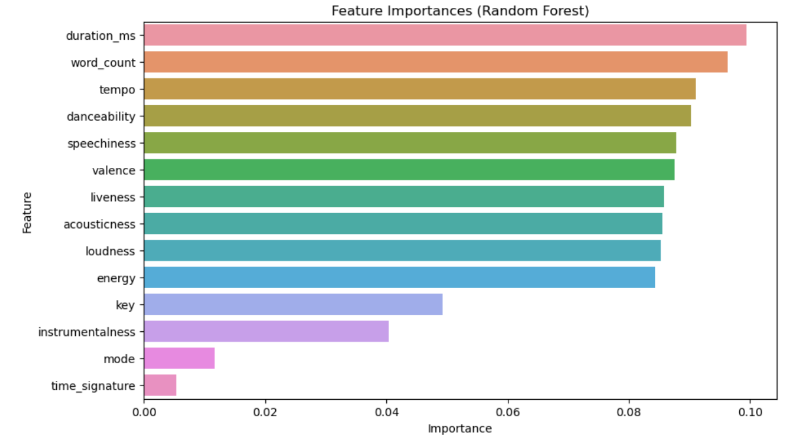
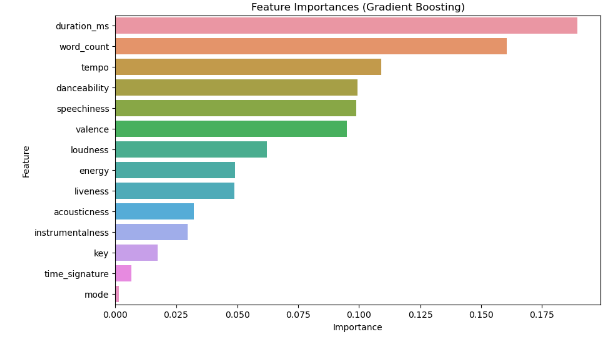
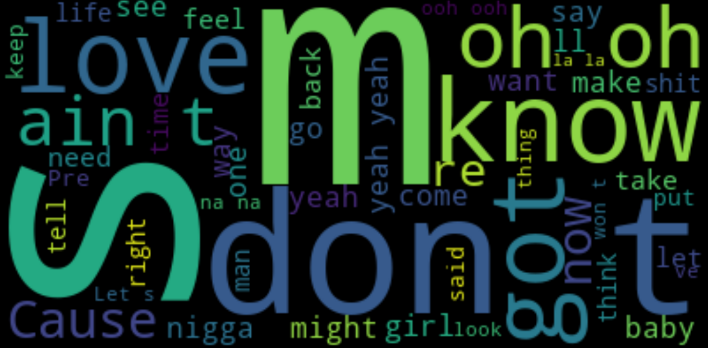
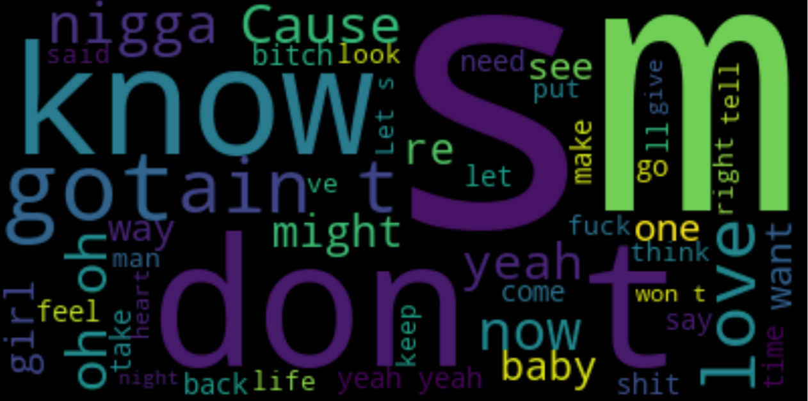
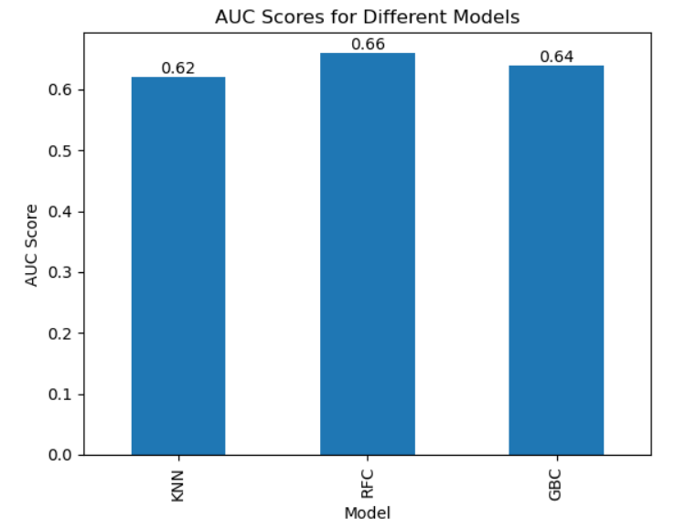
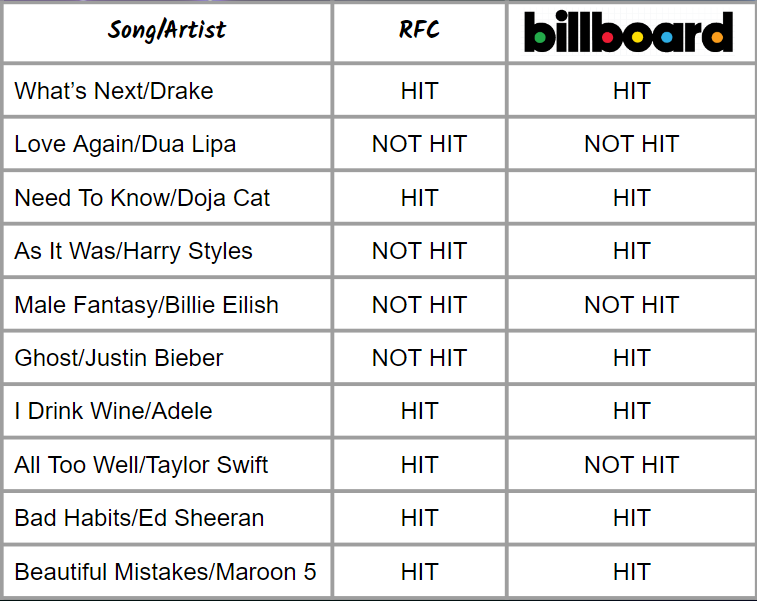
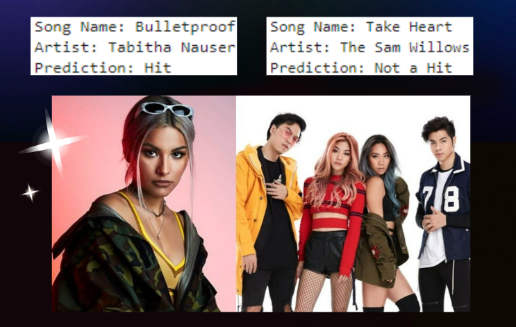

# Capstone Problem Statement and Dataset

## Problem Statement

Although the Singapore music scene is diverse and draws influences from various cultures and genres, the success of the local English music artists such as Tabitha Nauser and The Sam Willows, with the American and European audiences have been limited.

</img>

The objective of this project is to create a machine learning model that can predict the probability of a new song becoming a Billboard big hit by analyzing and learning particular audio characteristics and lyrics from past hit songs.

The machine learning model developed in this project could help solve the challenge of predicting the commercial success of new songs in the Singapore music industry. By analyzing specific audio features, lyrics and genres from past hit songs, the model can provide insights into what attributes make a song successful and predict the likelihood of a new song becoming a hit. This can be valuable information for music producers, artists, and record labels, as it can help them make more informed decisions about which songs to invest time and resources in promoting and marketing, potentially leading to more successful and profitable releases. Overall, the model could help improve the efficiency and effectiveness of the music industry in Singapore by reducing the risk associated with releasing new music.

## Data Sources

The project will begin by identifying the unique audio characteristics and lyrics of past Billboard Top Ten hit songs and building a dataset of these features for training the model. 

- Billboard Top 100 Weekly Charts. The charts will provide peak position data on the songs and their corresponding artists from year 1999 to 2019.
- Spotify Audio Features. Audio features and Genres of the respective songs will be scrapped from the Spotify API.
- Lyrics of songs. Lyrics of the respective songs will be scrapped from Genius.com.

</img>

## Machine Laearning Models 

Models used tentatively KNearest Neighbors, Random Forest Classifier and Gradient Boosting Classifier.
The model will be evaluated using established performance metrics such as accuracy, precision, and AUC to assess its ability to predict hit songs. The project will conclude by discussing the potential of the developed model to accurately predict the success of new, previously unseen songs and explaining why the model has the potential to make accurate predictions.

## Risks and Assumptions

There is currently no charts in the world that says a song is a dud or not a hit. So the assumption here will be using the Google definitive of a hit song which states that a song is considered to be a hit once it reaches the Top 40 of the Billboard Top 100 charts.

## Target Audience
This project will provide valuable insights to the music industry, record labels, artists, and streaming services, enabling them to make more informed decisions about the potential success of new songs. The primary stakeholders of this project are music industry professionals who require accurate predictions of successful songs for business decisions. The secondary stakeholders are music enthusiasts and data scientists interested in the application of machine learning to the music industry. The project will consider both current and past trends in the music industry to ensure that the model is relevant and accurate.

## Preprocessing 

### Lyrics

- Use RegEx to clean the lyrics. Remove all punctuation marks and square brackets.
- Use LangDetect to detect the language of the song. 

 NOTE we analyze songs that are fully English words only.  

In the dataset, we have 8900 plus English only songs.

</img>

### Genres

- Use MultiLabel Binarizer to label the genres for each song.

## EDA

### Audio Features Importance

Random Forest Feature Importance
</img>

Gradient Boosting Feature Importance
</img>

#### Intepretation of Feature Importances Plots:
- It can be seen from both RFC and GBC Feature Importances barplots that mode, time_signature, key and instrumentalness are 4 of the least important features.
- Hence, we will not use these 4 features for our analysis.

### Lyrics

- Use Wordcloud to check for common words between songs that are hits and non-hits. We will take out the common words during TFID Vectorizer process of the lyrics.

Hits Wordcloud
</img>

NonHits Wordcloud
</img>

## Machine Learning Model

3 models are used for this project:
- KNearest Neighbors
- Random Forest Classifier
- Gradient Boosting Classifier

</img>
The AUC barplot shows that the Random Forest Classifier model has the highest AUC score of 0.66 among the rest of the models. Hence, we will use the Random Forest Classifier as the best predictive model for Billboard hits prediction.

## Prediction of Songs (released after 2019)

</img>
We took 10 songs that were released after year 2019 and not within our dataset, and used our RFC model to do a prediction of these 10 songs. As can be seen from teh above table, our RFC model managed to correctly predict 7 out of 10 songs correctly.

Next, we look at 2 of Singapore local artists, Tabitha Nauser and The Sam Willows.
</img>
We don't have Billboard results as these songs were never released in the USA. But our RFC model predicted that Tabitha Nauser "Bulletproof" can make it to the Top 40 of the Billboard Top 100 whereas The Sam Willows "Take Heart" would not have made it. 

## Conclusion

From the Prediction of Songs section, we see that our RFC model predicted 7 out of 10 songs accurately. And it can also predict Singapore artist's song to be a hit or not in the international arena. This can help our local, small and independent record companies to invest and promote in potential hit songs that are locally produced.

Record Companies can use our predictive model to reduce the risk of investing resources in records/songs that are unlikely to be a hit. Our model which has an AUC score of 0.66 means that it is better discriminatory power than a random prediction of whether the song is a hit.